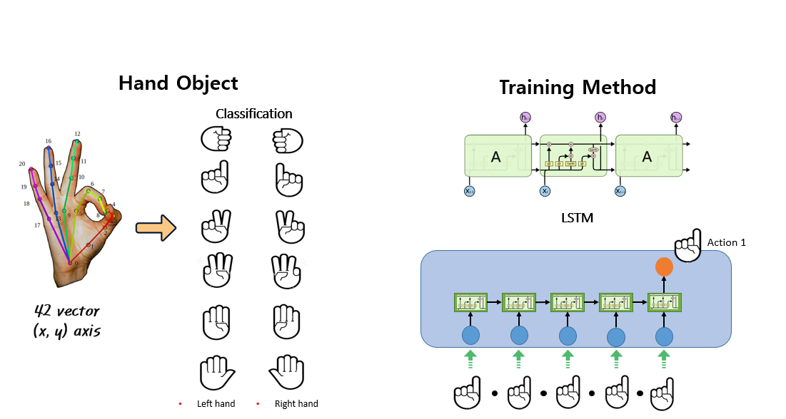

# Handvis
Controls the IoT device by recognizing the user's Hand Gesture  [Youtube Video](https://www.youtube.com/watch?v=a2Fvd71hR1M) 

## Requirement
- python 3.6  
- pytorch 0.4.0  

## Algorithm
- **L**ong **S**hort **T**erm **M**emory  
- Structure : Many to One    
- Dataset : 42 vector (x,y axis)    

    

## System

- [Web Server](https://github.com/qwebnm7788/handvis) : java/jsp
- Person Tracking & Deep Learning Server : openpose/LSTM
- [Android](https://github.com/swyh/handvis) : kotlin 
- Arduino
